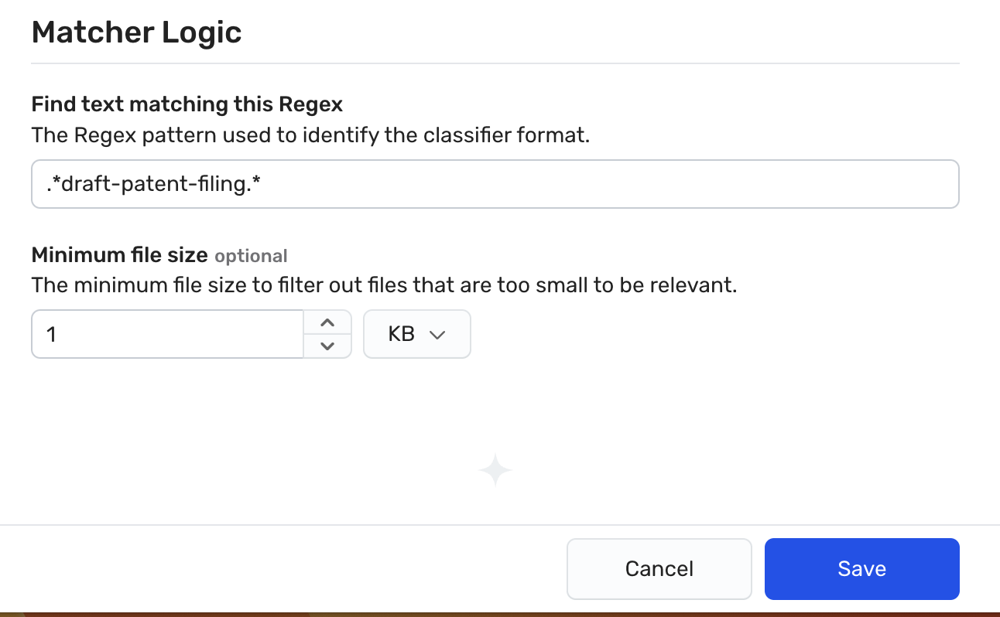
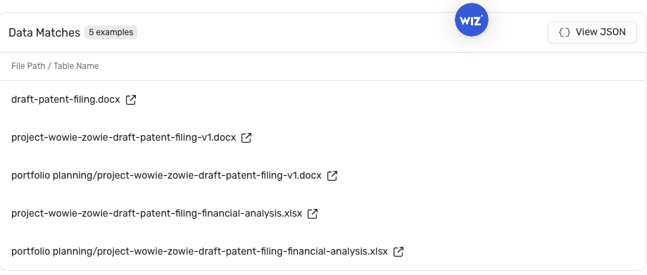

# Create a metadata classifier

## Scope

In this exercise, we create a custom metadata classifier that finds any files with "draft-patent-filing" in the title. The rule should generate data finding if such a file is detected. 

* First, we define the classifier severity level as "Critical" to reflect the sensitive nature of the content. 
* Second, we rescan a bucket resource to see if our rule fires on any of its contents.
* Last, we verify our rule by reviewing the finding results. 

### Expected Outcomes

Once the rule is defined and the bucket is rescanned, we will see some findings for the metadata classifier. 

## Task 1. Create the metadata classifier rule

1. In the Wiz portal, navigate to **Policies > Data Classification Rules**, and then click the **Create New Data Classification Rule** button.

1. Under Classification Type, select **Metadata match**.

1. In the Name box, enter a name for this rule using the following format:
    

   
         <inject key="ODLUser"></inject>-dspmlab-meta
   
      

1. (Optional) In the Description box, enter a description for the rule.
 Use this field to provide context for other users. While unnecessary for this lab, best practice states the purpose of the rule and use cases that it is expected to address. For example, "Identify working patent documents that are not submitted or pending. The intention is to prevent accidental public exposure of such material prior to patent submission. Expected to scan Word, PDF, and text file titles with our required title string 'draft-patent-filing'."

1. From the Data Type dropdown, select **Other**.
 As we are focused on proprietary information, this rule does not match known definitions, such as PHI or PII. As these types are used as filters in other pages, strive to keep them as accurate as possible.

     

       
     

6. From the Severity dropdown box, select **Critical**.
 Severity of the data classifier is only part of the formula used to designate the severity of a related data finding. Remember, it also considers the number of unique occurrences.

7. Under Matcher Logic in the Find text matching this Regex box, enter <code>.\*draft-patent-filing.\*</code>, which looks for the string 'draft-patent-filing' anywhere in the title of a file.
 In this regular expression, the following is true:
   - <code>.*</code> matches any character (except for a newline) zero or more times, 
   - <code>draft-patent-filing</code> is the literal string you want to match, 
   - <code>.*</code> again matches any character zero or more times.
   This regular expression will match the string "draft-patent-filing" anywhere within the filename or file type.
    **Tip:** You can enter a few file name examples in the Test Text box, with the string appearing in various places within the filename, and    click Test Logic to make sure that it matches as you expect. It is best practice to validate the RegEx syntax before deploying it. When using https://regex101.com/, select the Golang flavor. If you are struggling with correct syntax, ChatGPT is adept at generating the text. Less specific is better. For example, the query 'I need a regular expression that matches for the string "draft-patent-filing" in any filename or file type' generates the expression used above. 

8. In the Minimum file size box, enter **1** and select **KB** in the Bytes drop down. 
 **Tip:** Wiz recommends that you define a minimum file size to reduce the likelihood of false positives.
    

       
     

<!--  -->

9. Click **Create rule** to save the rule in the Wiz tenant.

Please answer the following question
<question source="https://raw.githubusercontent.com/dhananjaygr/InlineQuestions/main/100-Foundation/questions/Page2/question-01.md" />

## Task 2. Scan the bucket to test your finding

1. In the Wiz portal, navigate to **Explorer > Security Graph**.

1. Click on **FIND Cloud Resource...** and select **Bucket**.

1. Click the **+** to the right of that new node and select the **Name** property.

1. Change the operator to equals, and enter <code>s3-fileshare-rbm</code>
 **Tip:** Use equals for the fastest results. In exact string matches require additional processing. 

1. Click on the resulting node to open the Details drawer.

1. At the top of the drawer, click the three dots/ellipsis in the upper right to open the More options menu and click **Rescan resource**.
 <ins>Expected Result:</ins> There will be no visual cue that the rescan started. If you try to start it again, you will receive a message about a recent request.

1. On the Overview tab, scroll down to the Disk Scans section. Look at the **Last sucessful scan** column and verify that the Data Scan has completed since you triggered the rescan. 
   - If not, then wait longer. You will have to reopen the drawer to refresh the data pulled. 
   - If it has refreshed, then scroll up and on the left side click the **Data** drawer to see the findings and data analysis.

1. Under Has alerting Data Findings, scroll through the list of findings until you see a match for the rule that you defined. You may have to click **Load more** to see your results. 
 <ins>Expected Result:</ins> You find a match for two files in the data findings. If you expand that finding, you should see matches for files that include "draft-patent-filing" in the title.
    

       
     

Please answer the following question
<question source="https://raw.githubusercontent.com/dhananjaygr/InlineQuestions/main/100-Foundation/questions/Page2/question-02.md" />

