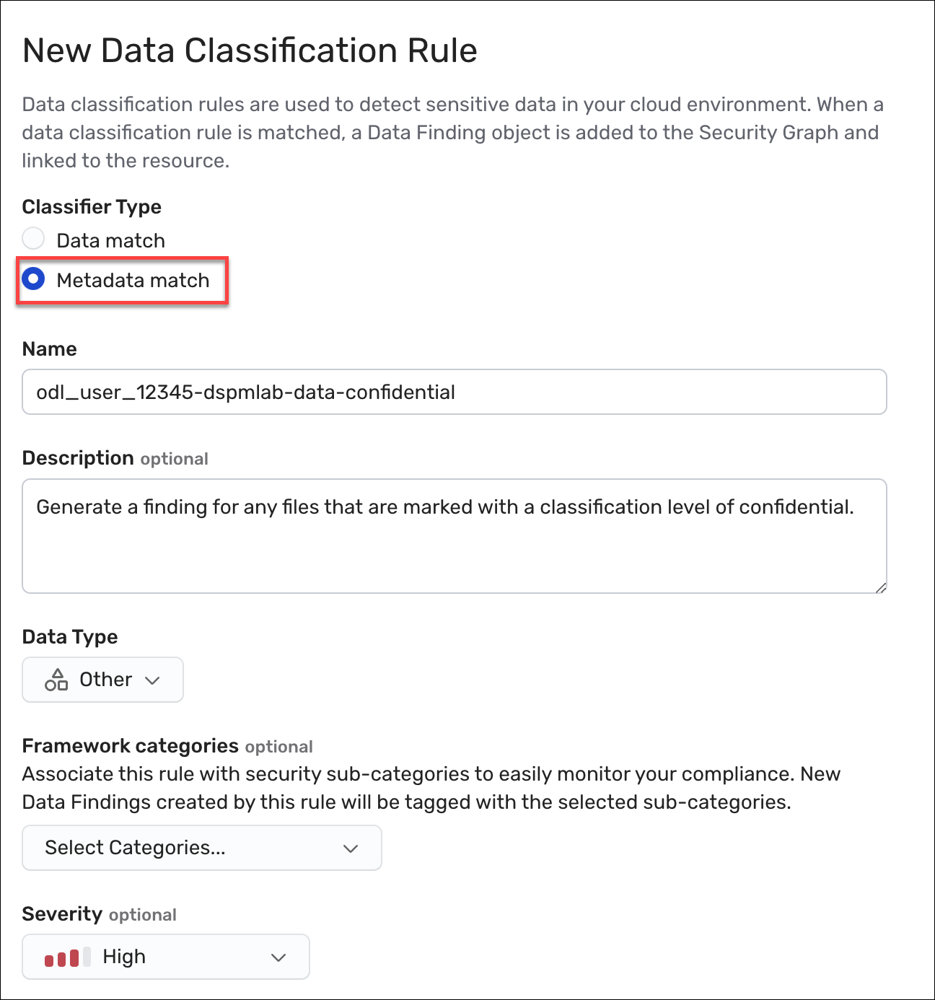
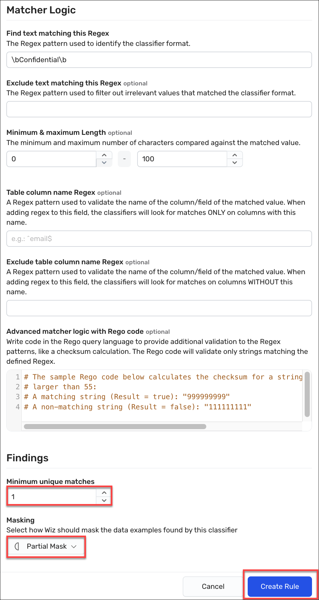

# Exercise: Create a custom data classifier

## Scope
In this exercise, we create three custom data classifiers to scan files for each sensitivity level. These rules generate data finding on the resource where such a file is detected. 
The task flow is as follows:

* First, we define the three data match rules. 
* Second, we rescan the bucket resource to see if our rules fire on any of its contents.
* Last, we verify our rules by reviewing the finding results. 

## Expected Outcomes

Once the rules are defined and the bucket is rescanned, we will see some findings for the data classifiers. 

## Task 1. For each rule, follow these steps to create the data classifier rule

1. In the Wiz portal, navigate to **Policies > Data Classification Rules**, and then click the **Create New Data Classification Rule** button.

1. Under Classification Type, select **Data match**.

1. In the Name box, enter:

    

   
         <inject key="ODLUser"></inject>-dspmlab-data-secret
   
      

1. In the Description box, enter:

    

        "Generate a finding for any files marked with a classification level of secret."
    

    
1. From the Data Type dropdown, select **Other**.

    As we are focused on proprietary information, this rule does not match any known definitions, such as PHI or PII. As these types are used as filters in other pages, you should strive to keep them as accurate as possible.

1. From the Severity dropdown box, select **Critical**.
    
    Severity of the data classifier is only part of the formula that is used to designate the severity of any related data finding. Remember that it is the number of unique occurrences.

   

       
        

1. Under Matcher Logic in the **Find text matching this Regex** field, enter: 

        \bSecret\b

1. Scroll down to the Findings section, in the **Minimum unique matches** field, enter **1**.
  
1. In the Masking drop-down menu, select **Partial Mask**.
   
    

       
        

1. Click **Create rule** to save the rule in the Wiz tenant.
 
#### ***Create two more rules repeating the steps in Task 1, with the following information:***

#### Confidential Classification Rule
* Rule name: *<inject enableCopy="false" key="ODLUser"></inject>-dspmlab-data-confidential*
* Description: "Generate a finding for any files marked with a classification level of confidential."
* Data Type: **Other**
* Classifier severity level: **High**
* Matcher logic: <code>\bConfidential\b</code>
* Set the Minimum unique matches to **1**.
* From the Masking list, select **Partial Mask**.

#### Unclassified Classification Rule
* Rule name: *<inject key="ODLUser" enableCopy="false"></inject>-dspmlab-data-unclassified*
* Description: "Generate a finding for any files marked with a classification level of unclassified."
* Data Type: **Other**
* Classifier severity level: **Info**
* Matcher logic: <code>\bUnclassified\b</code>
* Set the Minimum unique matches to **1**.
* From the Masking list, select **Partial Mask**.

Please answer the following question
<question source="https://raw.githubusercontent.com/dhananjaygr/InlineQuestions/main/100-Foundation/questions/Page3/question-01.md" />

## Task 2. Scan the bucket to test your finding

1. In the Wiz portal, navigate to **Explorer > Security Graph**.

1. Click on **FIND Cloud Resource...** and select **Bucket**.

1. Click the **+** to the right of that new node and select the **Name** property.

1. Change the operator to equals, then enter:

        s3-fileshare-rbm

    **Tip:** Use equals for the fastest results. Inexact string matches require additional processing.

1. Click on the resulting node to open the Details drawer.

1. At the top of the drawer, click the three dots/ellipsis in the upper right to open the More options menu and click **Rescan resource**.

    <u>Expected Result:</u> There will be no visual cue that the rescan started. If you try to start it again, you will receive a message about a recent request.

1. On the Overview tab, scroll down to the Disk Scans section. Look at the **Last sucessful scan** column and verify that the Data Scan has completed since you triggered the rescan. 

    - If not, then wait longer. You will have to reopen the drawer to refresh the data pulled. 
    - If it has refreshed, then scroll up and on the left side click the **Data** drawer to see the findings and data analysis.

1. Under *Has alerting Data Findings*, scroll through the list of findings until you see the matches for the rules that you defined. You may have to click **Load more** to see your results.
    - If you can't see Data Findings that match your rules, try re-scanning the Bucket for a 2nd time.
         
        <ins>Expected Result</ins>: You find a match for the following files in the data findings. If you expand that finding:
        
        - **Unclassified**. *rfp_request.docx* and *response_plan.docx*
        - **Classified**. *Archive.zip->faq-check.txt*, *Archive/bizplan.DOCX*, *Archive/faq-check.txt*, *bizplan_3.docx*,*deployment_plan.docx*, and *faq-check.txt*.
        - **Secret**. *supplies.docx*.

Please answer the following question
<question source="https://raw.githubusercontent.com/dhananjaygr/InlineQuestions/main/100-Foundation/questions/Page3/question-02.md" />

