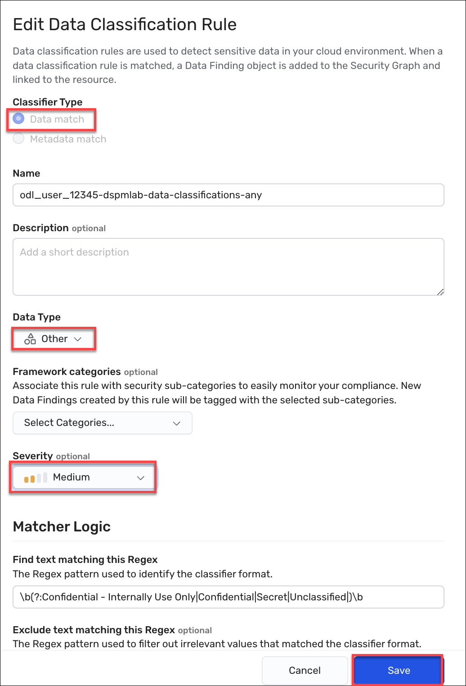
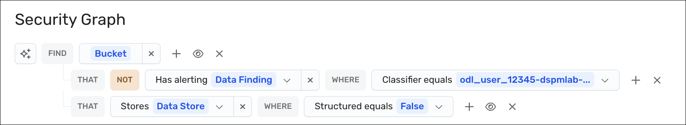

# Exercise: Create a control for data resources that are not in compliance with the data classification labeling

Your manager wants you to ensure all files that stored with one of the required sensitivity label. Generate a control that alerts when a bucket contains a file that does not contain one of the required sensitivity levels.

**Note:** Wiz does not scan every resource on a bucket. Instead, it samples the files on a bucket. Keep this in mind. We will only be able to leverage the concepts in this lab based on a sample concept. However, we are leveraging multiple concepts to shine a light in the dark--it all helps.

In this exercise, we will defeine a custom data classifier that scans files for any of the sensitivity levels. This rule generatew a data finding for any file that has one of the sensitivity levels. We use a single rule to match  any of those conditions (and a new condition -- 'Confidential - Internally Use Only'). This new condition is a lesson in "first match" evaluation within the data classification rule, as well as how to build more complicated evaluations using a control. 

The tasks to perform are as follows:
* First, define a data match rule that evaluates all four criteria.
* Second,  rescan a bucket resource to generate any findings for our rules.
* Third, define a control that looks for buckets that data on them but none of it matches the data match rule we defined.  
* Last, review the results to determine whether the control finds data stores with data but where that data does not match our neew rule. This results means the data has not been properly tagged.

## Expected Outcomes

Once the rules are defined and the bucket is rescanned, we will see some data stores where the data has not been properly tagged. These reults indicate an all or nothing. In other words, if some of the resources are tagged, we won't match the control criteria. If none of them are tagged correctly, we will. 

## Task 1. Create the data classifier rule that matches on any of the supported classification levels

1. In the Wiz portal, navigate to **Policies > Data Classification Rules**, and then click the **Create New Data Classification Rule** button.

1. Under Classifier Type, select **Data match**.

1. In the Name field, enter:

    

   
         <inject key="ODLUser"></inject>-dspmlab-data-class-any
   
      

1. In the Data Type dropdown, select **Other**.

    As we are focused on proprietary information, this rule does not match any known definitions, such as PHI or PII. As these types are used as filters in other pages, you should strive to keep them as accurate as possible.

1. From the Severity dropdown box, select **Medium**. We pick a middle ground here leveraging the more exact matches on Secret and Classified to indicate greater concern.

    Severity of the data classifier is only part of the formula that is used to designate the severity of any related data finding. Remember that it is the number of unique occurrences.

1. Under Matcher Logic in the Find text matching this Regex box, enter: 

    

        \b(?:Confidential - Internally Use Only|Confidential|Secret|Unclassified|)\b

    

    
    This classifier uses '|' to define OR conditions between the possible matches. We've ordered this rule to specifically match on the full string of 'Confidential - Internally Use Only' first. If 'Confidential' were lists first, it would match on both uses of confidential. While this appears to have no effect in the finding results, it dloes. The masked sample will be based on the full string of the match. 

    

       
        

1. Scroll down to the Findings section, in the **Minimum unique matches** field, enter **1**.

1. In the Masking drop-down meny, select **Partial Mask**.
    
    We select partial mask so we can get an idea of what we are seeing in the files. A full mask does not let us scan quickly to see what content is being tagged. This is especially useful when you have OR conditions in the matcher. 

1. Click **Create rule** to save the rule in the Wiz tenant.

## Task 2. Scan the bucket to test your finding

1. In the Wiz portal, navigate to **Explorer > Security Graph**.

1. Click on **FIND Cloud Resource...** and select **Bucket**.

1. Click the **+** to the right of that new node and select the **Name** property.

1. Change the operator to equals, then enter: 

    

        s3-fileshare-rbm

    

    **Tip:** Use equals for the fastest results. Inexact string matches require additional processing. 

1. Click on the resulting node to open the Details drawer.

1. At the top of the drawer, click the three dots/ellipsis in the upper right to open the More options menu and click **Rescan resource**.

    <u>Expected Result:</u> There will be no visual cue that the rescan started. If you try to start it again, you will receive a message about a recent request.

1. Close the bucket drawer.

## Task 3. Define the control

1. In the Security Graph page, click on **New**.

1. Click on **FIND Cloud Resource...** and select **Bucket**.

1. Click **+** to the right of the bucket object to add a condition and select **Data Finding: that alerted on it**.

1. Click **+** to the right of the Data Finding and select **Classifier**, select **Equals**, and then select the control you defined in Task 1, such as *<inject key="ODLUser" enableCopy="false"></inject>-dspmlab-data-classifications-any*.

1. What we see now is all of the buckets where that finding fired. We want to see the opposite, so select the eye at the end of the data classifier clause and select **Negate Relation**.
    
    <u>Expected Result:</u> The negated clause reads *THAT NOT Has Alerting Data Finding WHERE Classifier equals <inject key="ODLUser" enableCopy="false"></inject>-dspmlab-data-classifications-any*. This change indicates that you want to see any bucket where this classifuer did not generate a finding. And that is good, but we do not want to scan resources like databases. We know that by and large, we care about unstructured data files, such as PDFs, Docx, and text files.

1. To narrow down to buckets that have unstructured data without the finding, do the following. Next to the Bucket node, click the **+** again, and select **Data Store that stored on it**.

1. Click **+** to the right of the Data Store object and select the **Structured** flag.

1. We just said that we don't want structured data, so let's set the value of that Structured equals flag to **False**.
    
    Let's consider this query now. We select buckets that have occurrences of unstructured data, but they do not have any data finding that matches our required classification levels. What does that mean? It means that we have found a bucket with files that we likely care about, but none of those files are tagged using the data classification system our manager asked us to check for. So this is a good start. Now let's save this as a control so we generate as issue each time this rule files. The resulting issues are a resource level view of our question so we can remediate each resource individually.
   
    

       
        

   
1. To create the control, click **Save as control** to the right of the query.

1. In the New Control page, go to the Issue Severity dropdown box and select **High**. While the data sensitivity level is medium, this is a resource-wide issue. 

1. In the Name box, enter a name for this rule using the following format:

    

       <inject key="ODLUser"></inject>-Missing Required Sensitivity Classification

    

1. In the Description box, enter the following description: 

    

        This control looks for any buckets that contain unstructured data, such as Word files, PDFs, and text files, that are not tagged with one of the required sensitive classification levels. The intention is to find the resources so we can remediate them before they become a problem. It also satisfies our compliance requirement to periodically review resources for proper tagging.

    

1. In the Recommendations box, enter a description of how to remediate any resources that have this issue. In our scenario, we can use: 

    

        To resolve this issue, review all unstructured files on this bucket and ensure that they have the correct sensitivity classification tag setting. All files should be tagged as 'Secret', 'Confidential', or 'Unclassified'.

    

1. To save the control, click **Create Control**.

 

### Task 4. Verify the results of the data scan

 

1. Navigate to **Policies > Controls**.

1. Click on **All controls outside framework** and scroll down until you find the control you just defined.

1. Click on the  **<inject key="ODLUser" enableCopy="false"></inject>-Missing Required Sensitivity Classification** control (*your control*) to open the control drawer page. 

    

       
        

1. To see which resources match the control, click the **View on Security Graph** button.
    
    <u>Expected Result:</u> The Security Graph page appears with the query defined and the results appear in the table view.

1. Navigate to **Issues** and search for the control you have created.

1. Expand the Rule. You will see all instances that match the control (Issues).

    **Note:** In some cases, issues may take up to 24 hours to appear in the portal. 

Please provide feedback about the lab guide

<grouped-questions source="https://raw.githubusercontent.com/dhananjaygr/InlineQuestions/main/100-Foundation/questions/Page4/page4-metadata.md" />

### END OF LAB

Go back to the Lab page, and click on the trash can icon, next to the time. This will end your lab.

